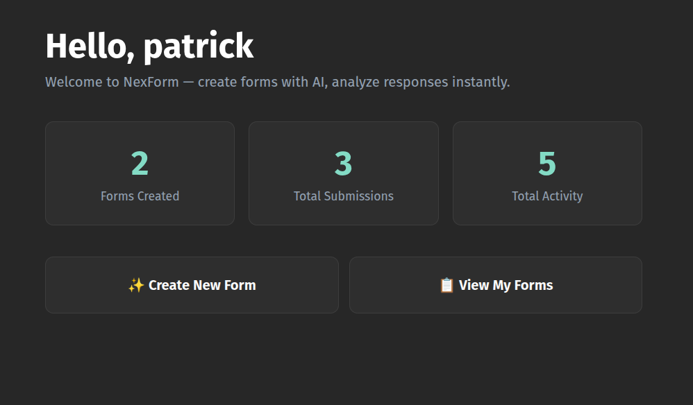
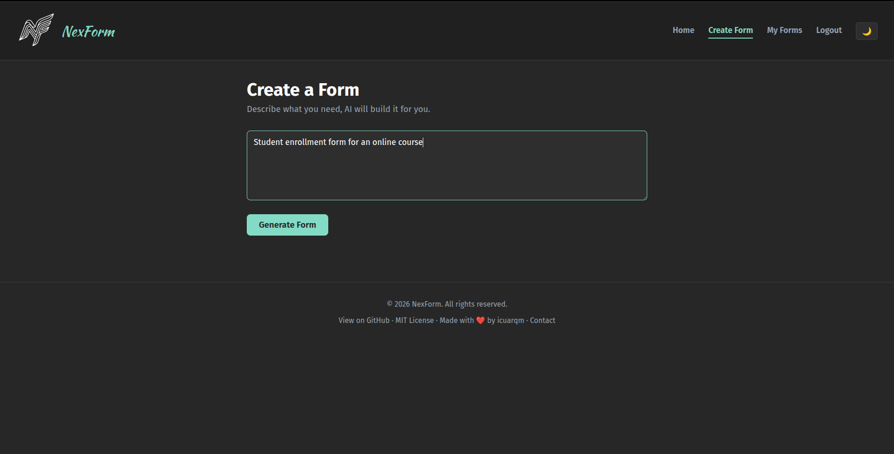
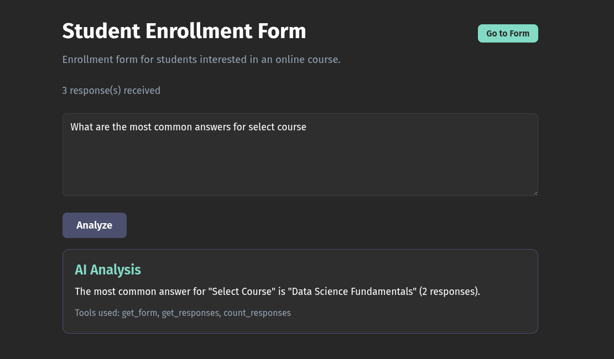

# NexForm

**NexForm** is an AI-powered form builder and response analysis platform.

It allows users to generate forms from natural language using LLMs, collect responses, and analyze submissions using AI.

This project combines a traditional backend stack (**PHP + MySQL**) with an AI service layer (**Python + Flask**) to explore practical AI-assisted product development.

---

## Features

- AI-generated forms from natural language prompts
- Form response collection
- AI-powered response analysis
- Authentication system
- Admin panel
- Docker-based development environment
- Support for multiple AI providers (OpenAI / Gemini)

---

## Screenshots

> Landing Page



> Form Generation



> Response Analysis



---

## Tech Stack

### Backend
- PHP
- MySQL

### AI Service
- Python
- Flask
- OpenAI API / Gemini API

### Infrastructure
- Docker
- Docker Compose

---

## Requirements

To run this project you need:

- Docker
- Docker Compose
- Python 3.8+

---

## Setup

Clone the repository:

```bash
git clone https://github.com/icuarqm/NexForm.git
cd NexForm
```

Create a `.env` file from `.env.example` using the setup script:

```bash
python scripts/setup_env.py
```

The setup script will generate and configure the .env file automatically.

Example configuration:

```env
GEMINI_API_KEY=your_gemini_api_key_here
OPENAI_API_KEY=your_openai_api_key_here
AI_PROVIDER=gemini

MYSQL_USER=root
MYSQL_ROOT_PASSWORD=root
MYSQL_DATABASE=nexform
MYSQL_HOST=db
MYSQL_PORT=3306

PHP_PORT=80
PHPMYADMIN_PORT=8080
AI_SERVICE_PORT=5000

AI_SERVICE_URL=http://ai:5000

ADMIN_SECRET_KEY=your_admin_secret_key_here
```

---

## Platform Requirements

### Linux
Install:

- Docker
- Docker Compose
- Python 3.8+

### macOS
Install:

- Docker Desktop
- Python 3.8+

### Windows
Install:

- Docker Desktop
- Python 3.8+
- WSL2

If required, also make sure virtualization is enabled.

---

## Running with Docker

For the first run, build and start all services:

```bash
docker compose up --build -d
```

For later runs, you can start the services without rebuilding:

```bash
docker compose up -d
```

This will start:

- PHP web application
- AI service
- MySQL database
- phpMyAdmin

To stop the containers:

```bash
docker compose down
```

After the containers are running, open your browser and go to:

```text
http://localhost
```

If you changed `PHP_PORT` in your `.env` file, use that port instead.

For phpMyAdmin:

```text
http://localhost:8080
```

If you changed `PHPMYADMIN_PORT` in your `.env` file, use that port instead.

---

## Example Workflow

1. Register an account
2. Generate a form using a natural language prompt
3. Share the form
4. Collect responses
5. Run AI analysis on the responses

---

## Future Improvements

Planned improvements:

- Form editing and updating
- Public share links
- Prompt injection protection (guardrails)
- Form quality evaluation
- Improved UI
- Extended analytics
